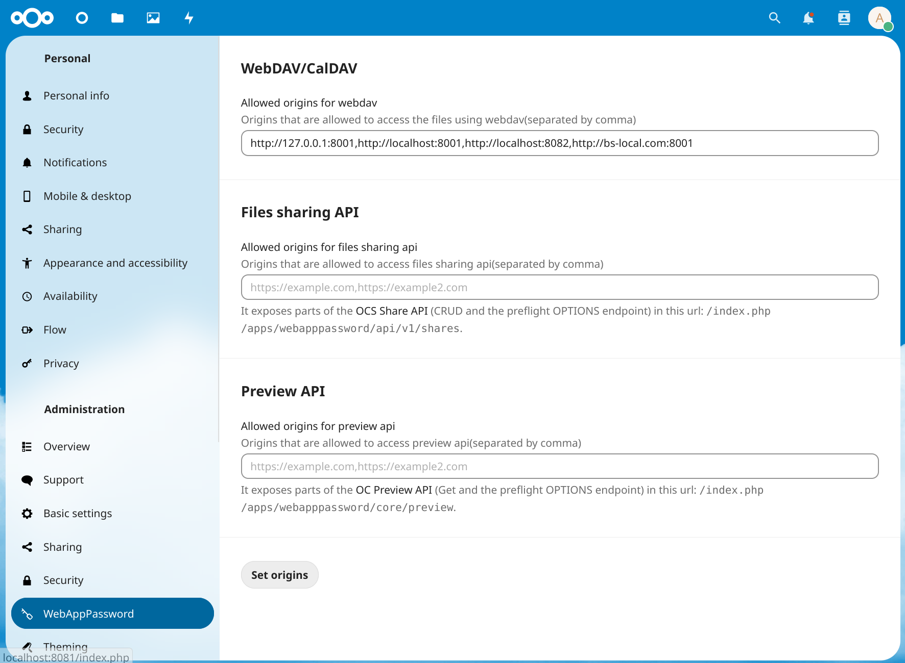

# Web App Password

This is a Nextcloud app to generate a temporary app password and set CORS headers to allow
WebDAV access from inside a webpage.

Place this app in **nextcloud/apps/**

## Configuration

You can configure the allowed origins on the settings page of the application.



Alternatively you can also add this setting to your `config/config.php`
(it will be used if the origins setting on the settings page are empty).

`'webapppassword.origins' => ['https://example.com'],` - array of allowed origins

The setting is both used for the origin of the CORS headers for the WebDAV requests and
for the referrer check whether we want to generate a temporary app password.

## Docker

* `cd docker`
* `docker-compose up`
* <http://localhost:8081> admin/admin
* (first time only) For the origin config see `WEBPASSWORD_ORIGINS` in docker-compose.yml

## Running tests

You can use the provided Makefile to run all tests by using:

```bash
make test
```

This will run the PHP unit and integration tests and if a package.json is present in the **js/** folder will execute **npm run test**

Of course you can also install [PHPUnit](http://phpunit.de/getting-started.html) and use the configurations directly:

```bash
phpunit -c phpunit.xml
```

or:

```bash
phpunit -c phpunit.integration.xml
```

for integration tests

## Generate translation

You will need the [translationtool](https://github.com/nextcloud/docker-ci/tree/master/translations/translationtool)
to generate the translation files for all languages.

```bash
php /path/to/translationtool.phar convert-po-files
```

See: [Manual translation](https://docs.nextcloud.com/server/19/developer_manual/app/view/l10n.html#manual-translation)

## Deploying to the Nextcloud app store

### Prerequisites

- Make sure your Nextcloud docker container is running in `./docker`
- Copy your app certificate files to `./docker/nextcloud/certificates`

### Signing and releasing

- Make sure the version in `appinfo/info.xml` and the `CHANGELOG.md` are updated
- Sign the app with `cd docker && make sign-app`
- You should now have a `webapppassword.tar.gz` in your git directory to release on
  [WebAppPassword releases](https://gitlab.tugraz.at/dbp/nextcloud/webapppassword/-/releases/)
  - You need to upload the file to the *Release notes* of the release
- Take the *Signature for your app archive*, which was printed by the sign-app command and
  release the app at [Upload app release](https://apps.nextcloud.com/developer/apps/releases/new)

## References

This Nextcloud application is used in the
[NextcloudFilePicker](https://gitlab.tugraz.at/dbp/web-components/toolkit/-/blob/master/packages/file-handling/src/dbp-nextcloud-file-picker.js)
web component to generate temporary app passwords and to allow WebDAV-access from
inside the web browser.
